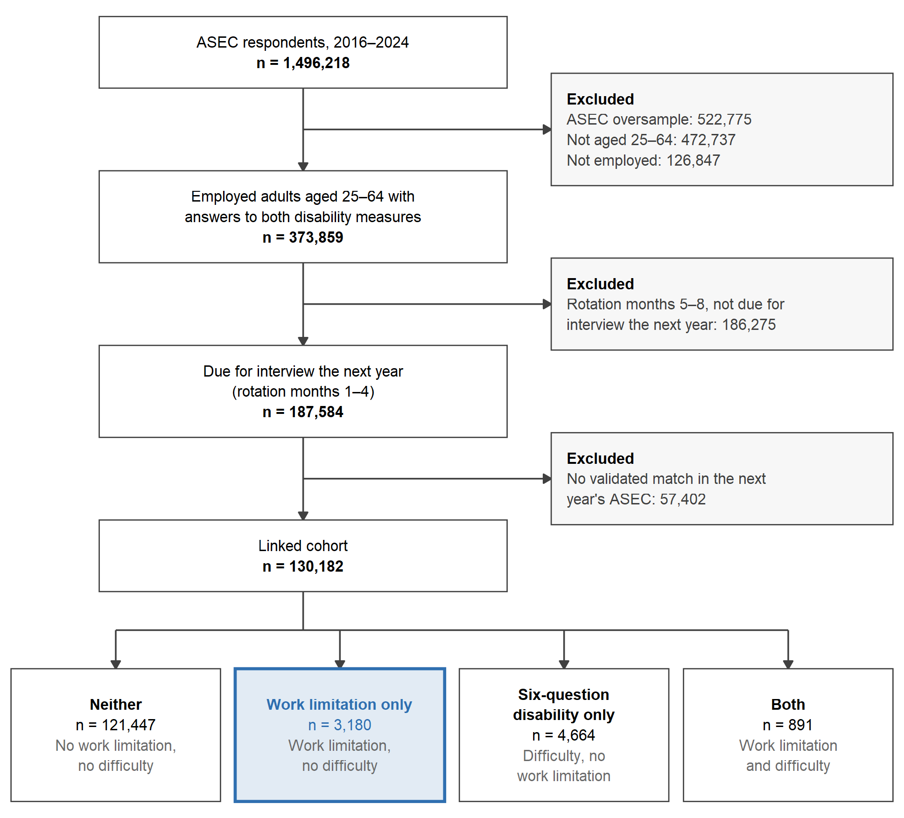
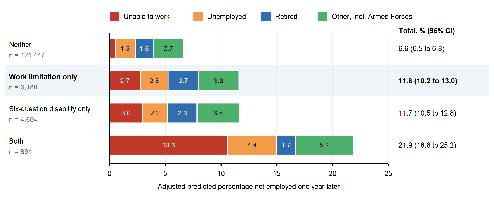
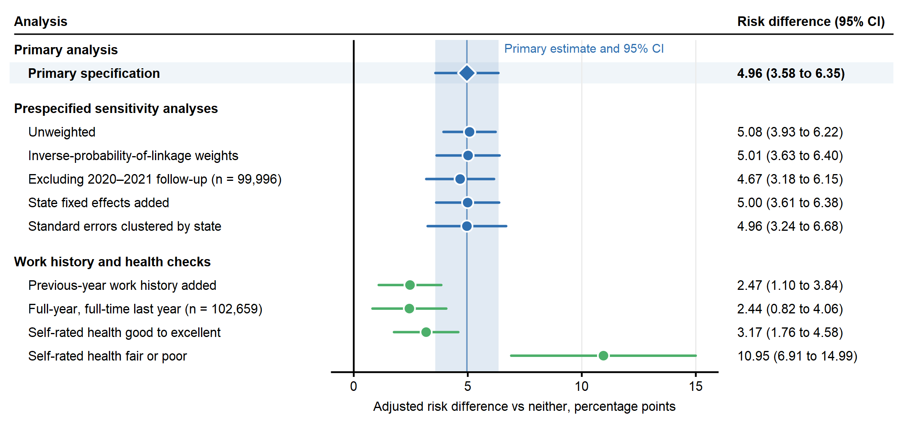

# Paper exhibits: work limitation outside the six-question disability standard and next-year employment exit

Generated by `scripts/work_limitation_paper_exhibits.R` from CPS extract 20 and the committed results in `2026-10-03-analysis.md` and `2026-10-03-profile-timing.md`. Table values, margins and the flow counts come from the data and are checked against those files. Figure 3 plots the committed estimates; the unweighted model and the two self-rated health strata are re-estimated here because their stored values (for example 3.175 and 14.995) fall on a rounding tie at two decimals. Not prespecified, added for the paper: adjusted odds ratios, adjusted risk ratios for the two comparison groups, and the adjusted predicted percentages in Figure 2.

## Integrity checks

|check                                                                                           |  met|
|:-----------------------------------------------------------------------------------------------|----:|
|Linked counts match the primary analysis (121,447; 3,180; 4,664; 891)                           | TRUE|
|Weighted exit rates match the committed analysis (to 4 decimals)                                | TRUE|
|Exit destinations match the committed profile-timing results (to 3 decimals)                    | TRUE|
|Adjusted risk differences reproduce the committed primary model (to 4 decimals)                 | TRUE|
|Adjusted risk ratio reproduces the committed Poisson model (1.70, 1.51 to 1.91)                 | TRUE|
|Unweighted model reproduces the committed sensitivity row (to 4 decimals)                       | TRUE|
|Self-rated health strata reproduce the committed T3 rows (to 3 decimals)                        | TRUE|
|Adjusted margins: group difference equals the primary risk difference; destinations sum to exit | TRUE|

## Participant flow

|step          |         n|
|:-------------|---------:|
|respondents   | 1,496,218|
|ex_oversample |   522,775|
|ex_age        |   472,737|
|ex_employed   |   126,847|
|ex_items      |         0|
|employed_both |   373,859|
|ex_rotation   |   186,275|
|eligible      |   187,584|
|ex_unlinked   |    57,402|
|ex_weight     |         0|
|cohort        |   130,182|

## Table 1. Baseline characteristics of linked workers aged 25–64, by baseline group, CPS ASEC 2016–2024

|Characteristic                                         |                  Neither|    Work limitation only| Six-question disability only|                    Both|                      All|
|:------------------------------------------------------|------------------------:|-----------------------:|----------------------------:|-----------------------:|------------------------:|
|Linked workers, n                                      |                  121,447|                   3,180|                        4,664|                     891|                  130,182|
|Share of employed adults aged 25–64, %a     |                     94.1|                     2.4|                          2.9|                     0.6|                    100.0|
|Age, mean (SD), years                                  |              43.9 (11.6)|             45.7 (11.6)|                  47.7 (12.0)|             48.2 (11.7)|              44.1 (11.6)|
|Aged 55–64, %                                          |                     23.6|                    29.7|                         38.3|                    39.5|                     24.4|
|Female, %                                              |                     47.1|                    51.9|                         47.1|                    49.5|                     47.2|
|Race and ethnicity, %                                  |                         |                        |                             |                        |                         |
|&emsp;Hispanic                                         |                     12.3|                     9.7|                          9.7|                     5.7|                     12.1|
|&emsp;Non-Hispanic Black                               |                      9.5|                     9.5|                          8.9|                     8.8|                      9.5|
|&emsp;Non-Hispanic White                               |                     70.9|                    74.7|                         76.3|                    81.1|                     71.2|
|&emsp;Non-Hispanic, other or multiple races            |                      7.3|                     6.1|                          5.1|                     4.3|                      7.2|
|Education, %                                           |                         |                        |                             |                        |                         |
|&emsp;Less than high school                            |                      5.2|                     5.2|                          6.9|                     6.4|                      5.2|
|&emsp;High school diploma or equivalent                |                     24.3|                    29.3|                         29.0|                    35.9|                     24.7|
|&emsp;Some college                                     |                     25.3|                    32.5|                         32.9|                    34.2|                     25.8|
|&emsp;Bachelor's degree or higher                      |                     45.2|                    33.0|                         31.2|                    23.6|                     44.3|
|Work in the previous calendar year                     |                         |                        |                             |                        |                         |
|&emsp;Weeks worked, mean (SD)                          |               49.2 (9.3)|             42.4 (15.1)|                  48.3 (10.6)|             38.2 (17.9)|               48.9 (9.7)|
|&emsp;Worked 50–52 weeks, %                            |                     87.7|                    57.6|                         83.6|                    50.1|                     86.5|
|&emsp;Usually worked full time, %                      |                     87.7|                    73.2|                         80.6|                    45.1|                     86.7|
|Usual weekly hours at interview, mean (SD)b |              41.1 (10.2)|             38.2 (12.0)|                  39.5 (12.3)|             29.2 (15.5)|              40.9 (10.4)|
|Family income, median (IQR), 2024 US$c      | 115,700 (66,300–188,000)| 96,700 (51,700–159,800)|      90,400 (52,200–150,700)| 59,000 (30,500–121,300)| 113,700 (64,900–185,600)|
|Family income below the poverty line, %c    |                      3.4|                     6.0|                          5.5|                    11.8|                      3.6|
|Self-rated health fair or poor, %                      |                      5.1|                    17.8|                         18.5|                    46.0|                      6.2|
|Medicaid coverage at interview, %                      |                      6.9|                    12.5|                         12.2|                    34.1|                      7.4|
|Medicare coverage at interview, %                      |                      0.6|                     3.4|                          2.9|                    22.9|                      0.9|
|Disability income in the previous year, %d  |                      0.0|                    24.9|                          0.2|                    16.3|                      0.8|

Weighted percentages, means and medians; unweighted counts. Work limitation: a health problem that prevented or limited work in the previous calendar year. Six-question disability: a yes to any of the six questions on hearing, vision, cognition, walking, self-care and errands. SD, standard deviation; IQR, interquartile range.

a All employed adults aged 25–64 in ASEC 2016–2024, full sample with the ASEC weight (n = 570,447); the work-limitation-only group averaged 3.0 million workers a year.

b Excludes 7,823 workers whose hours vary.

c Previous calendar year; 2024 dollars.

d Asked mainly of people who report a work limitation; not comparable across groups.

## Table 2. Not employed one year later, by baseline group (n = 130,182)

|Baseline group                                                |       n| Not employed, %a| Adjusted risk difference, percentage points (95% CI)b| Pb| Adjusted risk ratio (95% CI)c| Adjusted odds ratio (95% CI)d|
|:-------------------------------------------------------------|-------:|---------------------------:|----------------------------------------------------------------:|-------------:|----------------------------------------:|----------------------------------------:|
|**Not employed one year later**                               |        |                            |                                                                 |              |                                         |                                         |
|&emsp;Neither                                                 | 121,447|                         6.6|                                                        Reference|              |                                Reference|                                Reference|
|&emsp;Work limitation only                                    |   3,180|                        12.1|                                              4.96 (3.58 to 6.35)|        <0.001|                      1.70 (1.51 to 1.91)|                      1.81 (1.59 to 2.08)|
|&emsp;Six-question disability only                            |   4,664|                        12.5|                                              5.03 (3.83 to 6.22)|        <0.001|                      1.67 (1.51 to 1.84)|                      1.78 (1.59 to 2.00)|
|&emsp;Both                                                    |     891|                        23.0|                                           15.22 (11.91 to 18.53)|        <0.001|                      3.00 (2.59 to 3.47)|                      3.70 (3.04 to 4.50)|
|**By status one year later, work limitation only vs neither** |        |                            |                                                                 |              |                                         |                                         |
|&emsp;Out of the labor force, unable to work                  |        |                  2.8 vs 0.5|                                              2.23 (1.45 to 3.02)|        <0.001|                                         |                                         |
|&emsp;Unemployed                                              |        |                  2.5 vs 1.8|                                              0.72 (0.08 to 1.36)|         0.027|                                         |                                         |

Weighted; n is unweighted. Models adjust for age group, sex, race and ethnicity, education and survey year, with standard errors clustered by household.

a Lower panel: work limitation only vs neither.

b Linear probability model (primary).

c Poisson model.

d Logistic model; not prespecified.

## Figure 1

**Figure 1.** Selection of the analytic cohort, CPS ASEC 2016–2024. Difficulty: a yes to at least one of the six federal disability questions.

## Figure 2

**Figure 2.** Adjusted predicted percentage not employed one year later, by baseline group and status at follow-up. Adjusted for age group, sex, race and ethnicity, education and survey year; segments add up to the total. Other includes 25 people who had joined the Armed Forces.

## Figure 3

**Figure 3.** Adjusted risk difference in not being employed one year later, work limitation only vs neither, across specifications. Lines are 95% confidence intervals; the shaded band is the primary estimate's interval. Blue: primary and prespecified sensitivity analyses; green: checks specified after the primary result. n = 130,182 unless shown.

## Supplementary Table S1. Unadjusted status one year later, by baseline group (weighted %)

|Baseline group               |       n| Not employed, n (unweighted)| Not employed| Out of the labor force, unable to work| Unemployed| Retired| Out of the labor force, other reason, or Armed Forces|
|:----------------------------|-------:|----------------------------:|------------:|--------------------------------------:|----------:|-------:|-----------------------------------------------------:|
|Neither                      | 121,447|                        7,710|          6.6|                                    0.5|        1.8|     1.6|                                                   2.7|
|Work limitation only         |   3,180|                          382|         12.1|                                    2.8|        2.5|     3.1|                                                   3.7|
|Six-question disability only |   4,664|                          557|         12.5|                                    3.1|        2.2|     3.4|                                                   3.8|
|Both                         |     891|                          200|         23.0|                                   10.8|        4.4|     2.6|                                                   5.2|

The four statuses add up to the percentage not employed, apart from rounding. Other includes people who had joined the Armed Forces (Neither 23; Work limitation only 1; Six-question disability only 1; Both 0).

## Checks added after review (not prespecified)

|analysis                                                |      n|      rd_pp|    ci_low|  ci_high|         p|
|:-------------------------------------------------------|------:|----------:|---------:|--------:|---------:|
|Work limitation only minus six-question disability only | 130182| -0.0625679| -1.868786| 1.743650| 0.9458697|
|Armed Forces at follow-up counted as employed           | 130182|  4.9091492|  3.532428| 6.285871| 0.0000000|

Files: `figure1`–`figure3` as `.pdf` (vector, fonts embedded), `.tiff` (1,000 dpi, LZW) and `.png` (300 dpi preview); `table1.csv`, `table2.csv`, `table-s1-destinations.csv`, `figure2-adjusted-margins.csv`, `figure3-estimates.csv`.

R version 4.6.1 (2026-06-24 ucrt); fixest 0.14.2; ggplot2 4.0.3; CPS extract 20 (ASEC 2016–2025).
